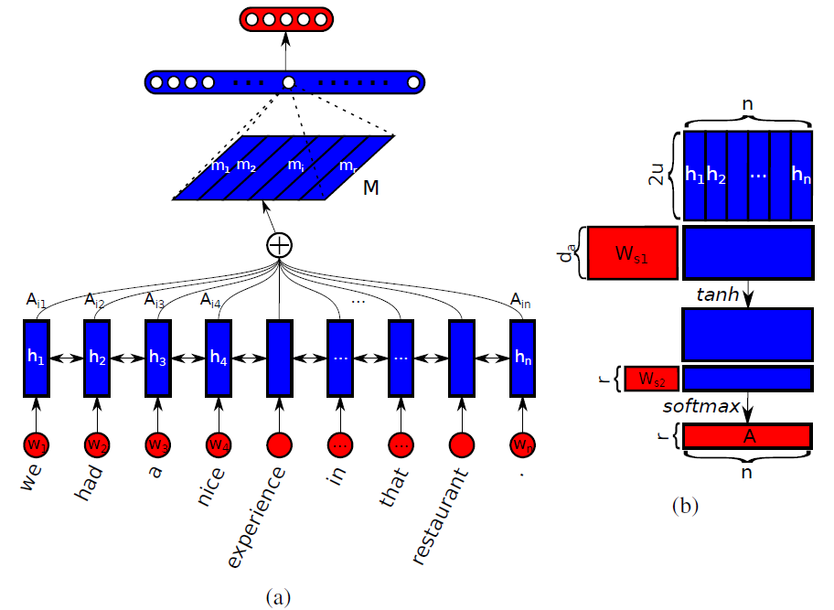

##  基于自注意力结构的句子表示的实现

这是一个关于[A Structured Self-Attentive Sentence Embedding](https://arxiv.org/abs/1703.03130) 论文的实现。本程序使用Mxnet/Gluon实现了论文中的大多数细节，并选择原论文中提及到的三个实验中的用户评论情感星级进行实验，且采用相同的数据集：[The reviews of Yelp Data](https://www.kaggle.com/yelp-dataset/yelp-dataset#yelp_academic_dataset_review.json) 进行实验，模型结构如下图：




## 环境需要

1. [Mxnet](https://mxnet.apache.org/)
2. [Gluon NLP](https://gluon-nlp.mxnet.io)
3. [Numpy](http://www.numpy.org/)
4. [Scikit-Learn](http://scikit-learn.org/stable/)
5. [Python3](https://www.python.org) 

## 已实现的具体功能

1. **论文提出的注意力机制**


$$
   A = softmax(W_{s2}tanh(W_{s1}H^T))
$$

2. **惩罚项约束以保证注意力的多样性**


$$
   P = ||(AA^T-I)||_F^2
$$

3. **论文附录中提出的参数修剪**


   

   4. **梯度修剪和学习率衰减**
   5. **带类别权重的 SoftmaxCrossEntropy**

   ## 论文模型用于评论星级分类

   1. 训练参数说明：

      ```python
      parser.add_argument('--emsize', type=int, default=300,
                              help='size of word embeddings')
          parser.add_argument('--nhid', type=int, default=300,
                              help='number of hidden units per layer')
          parser.add_argument('--nlayers', type=int, default=1,
                              help='number of layers in BiLSTM')
          parser.add_argument('--attention-unit', type=int, default=350,
                              help='number of attention unit')
          parser.add_argument('--attention-hops', type=int, default=1,
                              help='number of attention hops, for multi-hop attention model')
          parser.add_argument('--drop-prob', type=float, default=0.5,
                              help='dropout applied to layers (0 = no dropout)')
          parser.add_argument('--clip', type=float, default=0.5,
                              help='clip to prevent the too large grad in LSTM')
          parser.add_argument('--nfc', type=int, default=512,
                              help='hidden (fully connected) layer size for classifier MLP')
          parser.add_argument('--lr', type=float, default=.001,
                              help='initial learning rate')
          parser.add_argument('--epochs', type=int, default=10,
                              help='upper epoch limit')
          parser.add_argument('--loss-name', type=str, default='sce', help='loss function name')
          parser.add_argument('--seed', type=int, default=2018,
                              help='random seed')
      
          parser.add_argument('--pool-way', type=str, default='flatten', help='pool att output way')
          parser.add_argument('--prune-p', type=int, default=None, help='prune p size')
          parser.add_argument('--prune-q', type=int, default=None, help='prune q size')
      
          parser.add_argument('--batch-size', type=int, default=64,
                              help='batch size for training')
          parser.add_argument('--class-number', type=int, default=5,
                              help='number of classes')
          parser.add_argument('--optimizer', type=str, default='Adam',
                              help='type of optimizer')
          parser.add_argument('--penalization-coeff', type=float, default=0.1,
                              help='the penalization coefficient')
      
          parser.add_argument('--save', type=str, default='../models', help='path to save the final model')
          parser.add_argument('--wv-name', type=str, choices={'glove', 'w2v', 'fasttext', 'random'},
                              default='random', help='word embedding way')
          parser.add_argument('--data-json-path', type=str, default='../data/sub_review_labels.json', help='raw data path')
          parser.add_argument('--formated-data-path', type=str,
                              default='../data/formated_data.pkl', help='formated data path')
      ```

   2. **训练细节**

      原论文中使用 500K 数据作为训练集， 2000 条数据作为验证集，2000 条作为测试集。由于个人机器限制，所以采用在保证数据分布同原文数据的情况下随机抽取 200 K 作为 训练集，2000 条数据作为验证集，根据数据类别的比例设置了 WeightedSoftmaxCrossEntropy 的类别权重，若使用数据不同且需要使用这个损失函数，则需自己修改设定的 class_weight 的值。

      训练使用(参数可自定义配置)：

      ```python
      python train_model.py --nlayers 1 --epochs 5 --attention-hops 2 --loss-name sce
      ```

   ## 引用参考

   1. **[A Structured Self-Attentive Sentence Embedding](https://arxiv.org/abs/1703.03130)** 

   2. **[The reviews of Yelp Data](https://www.kaggle.com/yelp-dataset/yelp-dataset#yelp_academic_dataset_review.json)**
